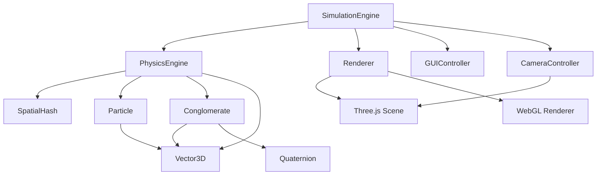

# Design Document: 3D Particle Aggregation Simulation

## Overview

This design extends the existing 2D dust particle aggregation simulation to full 3D space. The system will maintain all physics properties (momentum conservation, energy conservation, angular momentum) while transitioning from Canvas 2D rendering to WebGL-based 3D rendering using Three.js.

The architecture follows the same modular design as the 2D version:
- **Vector3D**: 3D vector mathematics
- **PhysicsEngine**: 3D Newtonian mechanics
- **SpatialHash**: 3D grid-based collision detection
- **Conglomerate**: 3D rigid body dynamics with quaternion rotation
- **Renderer**: Three.js-based 3D visualization
- **CameraController**: Orbit controls for 3D navigation
- **SimulationEngine**: Main loop and coordination
- **GUIController**: Parameter controls

## Architecture

### System Components



### Key Architectural Changes from 2D

1. **Vector2D → Vector3D**: All position, velocity, and force calculations now use 3D vectors
2. **Canvas 2D → Three.js/WebGL**: Hardware-accelerated 3D rendering
3. **2D Rotation (angle) → 3D Rotation (quaternion)**: Proper 3D orientation representation
4. **4 edges → 6 faces**: Particle spawning on cubic boundary faces
5. **2D Spatial Hash → 3D Spatial Hash**: Grid cells are now cubes instead of squares
6. **Camera**: New component for 3D view control (orbit, zoom, pan)

## Components and Interfaces

### Vector3D Class

The Vector3D class provides all mathematical operations needed for 3D physics.

```typescript
class Vector3D {
  constructor(public x: number, public y: number, public z: number) {}
  
  // Basic operations
  add(other: Vector3D): Vector3D
  subtract(other: Vector3D): Vector3D
  multiply(scalar: number): Vector3D
  divide(scalar: number): Vector3D
  
  // Magnitude and normalization
  magnitude(): number
  magnitudeSquared(): number
  normalize(): Vector3D
  
  // Vector products
  dot(other: Vector3D): number
  cross(other: Vector3D): Vector3D
  
  // Distance
  distanceTo(other: Vector3D): number
  
  // Utility
  static zero(): Vector3D
  static random(min: number, max: number): Vector3D
  equals(other: Vector3D, epsilon?: number): boolean
}
```

**Key 3D Operations:**
- **Cross Product**: Returns a vector perpendicular to both inputs, essential for torque calculations
- **3D Distance**: Euclidean distance in 3D space: `sqrt(dx² + dy² + dz²)`

### Quaternion Class

Quaternions provide stable, gimbal-lock-free 3D rotation representation.

```typescript
class Quaternion {
  constructor(
    public w: number,  // Scalar part
    public x: number,  // Vector part
    public y: number,
    public z: number
  ) {}
  
  // Creation
  static identity(): Quaternion
  static fromAxisAngle(axis: Vector3D, angle: number): Quaternion
  static fromEuler(x: number, y: number, z: number): Quaternion
  
  // Operations
  multiply(other: Quaternion): Quaternion
  conjugate(): Quaternion
  normalize(): Quaternion
  
  // Rotation application
  rotateVector(v: Vector3D): Vector3D
  
  // Conversion
  toRotationMatrix(): Matrix3x3
  toEuler(): { x: number, y: number, z: number }
}
```

**Why Quaternions:**
- No gimbal lock (unlike Euler angles)
- Efficient interpolation (SLERP)
- Compact representation (4 numbers vs 9 for matrix)
- Stable numerical properties

### Particle Class (3D Extension)

```typescript
class Particle {
  id: string
  position: Vector3D
  velocity: Vector3D
  mass: number
  radius: number
  angularVelocity: Vector3D  // Now a 3D vector (axis * magnitude)
  
  // Physics methods
  applyForce(force: Vector3D, deltaTime: number): void
  applyTorque(torque: Vector3D, deltaTime: number): void
  update(deltaTime: number): void
  
  // Properties
  momentum(): Vector3D
  kineticEnergy(): number
  angularMomentum(): Vector3D
}
```

**Key Changes:**
- `angularVelocity` is now a Vector3D (rotation axis direction, magnitude is rotation speed)
- `applyTorque` takes a Vector3D torque vector
- `angularMomentum()` returns a Vector3D

### Conglomerate Class (3D Extension)

```typescript
class Conglomerate {
  id: string
  particles: Particle[]
  centerOfMass: Vector3D
  velocity: Vector3D
  totalMass: number
  angularVelocity: Vector3D
  orientation: Quaternion  // 3D rotation state
  radius: number
  
  // Relative positions in local space (fixed shape)
  private relativePositions: Vector3D[]
  
  // Physics methods
  applyForce(force: Vector3D, deltaTime: number): void
  applyTorque(torque: Vector3D, deltaTime: number): void
  update(deltaTime: number): void
  
  // Properties
  calculateMomentOfInertiaTensor(): Matrix3x3
  calculateAngularMomentum(): Vector3D
  momentum(): Vector3D
  kineticEnergy(): number
  
  // Merging
  merge(other: Conglomerate): Conglomerate
}
```

**Key 3D Concepts:**

1. **Moment of Inertia Tensor**: In 3D, moment of inertia is a 3x3 matrix, not a scalar
   ```
   I = [ Ixx  Ixy  Ixz ]
       [ Iyx  Iyy  Iyz ]
       [ Izx  Izy  Izz ]
   ```
   
   For point masses: `Ixx = Σ m_i(y_i² + z_i²)`, etc.

2. **Angular Momentum**: `L = I * ω` where I is the tensor and ω is angular velocity vector

3. **Quaternion Update**: 
   ```typescript
   // Update orientation using angular velocity
   const deltaQ = Quaternion.fromAxisAngle(
     angularVelocity.normalize(),
     angularVelocity.magnitude() * deltaTime
   )
   orientation = deltaQ.multiply(orientation).normalize()
   ```

4. **Particle Position Update**:
   ```typescript
   // Rotate relative position by current orientation
   const worldPos = orientation.rotateVector(relativePositions[i])
   particles[i].position = centerOfMass.add(worldPos)
   ```

### SpatialHash Class (3D Extension)

```typescript
class SpatialHash {
  cellSize: number
  private grid: Map<string, Entity[]>
  
  constructor(cellSize: number)
  
  clear(): void
  insert(entity: Entity): void
  getNearby(entity: Entity): Entity[]
  
  // 3D grid hashing
  private hash(x: number, y: number, z: number): string
  private getCellCoords(position: Vector3D): { x: number, y: number, z: number }
}
```

**3D Spatial Hashing:**
- Grid cells are cubes with side length `cellSize`
- Hash function: `"${x},${y},${z}"` for cell coordinates
- Entity spans multiple cells if radius > cellSize/2
- Query checks 27 cells (3×3×3 cube) around entity position

**Cell Calculation:**
```typescript
// For an entity at position with radius
const minX = Math.floor((position.x - radius) / cellSize)
const maxX = Math.floor((position.x + radius) / cellSize)
const minY = Math.floor((position.y - radius) / cellSize)
const maxY = Math.floor((position.y + radius) / cellSize)
const minZ = Math.floor((position.z - radius) / cellSize)
const maxZ = Math.floor((position.z + radius) / cellSize)

// Insert into all cells in this range
for (let x = minX; x <= maxX; x++) {
  for (let y = minY; y <= maxY; y++) {
    for (let z = minZ; z <= maxZ; z++) {
      insertIntoCell(x, y, z, entity)
    }
  }
}
```

### PhysicsEngine Class (3D Extension)

```typescript
class PhysicsEngine {
  private gravityFormula: GravityFormula
  private elasticity: number
  
  constructor(gravityFormula: GravityFormula, elasticity: number)
  
  // Gravity (now in 3D)
  calculateGravitationalForce(e1: Entity, e2: Entity): Vector3D
  applyGravity(entities: Entity[], deltaTime: number): void
  
  // Collision detection (3D sphere-sphere)
  detectCollisions(entities: Entity[], spatialHash: SpatialHash): CollisionPair[]
  resolveCollision(pair: CollisionPair): void
  
  // Collision response (3D impulse)
  calculateCollisionImpulse(e1: Entity, e2: Entity): Vector3D
  
  // Merging
  shouldMerge(e1: Entity, e2: Entity, threshold: number): boolean
  mergeEntities(e1: Entity, e2: Entity): Conglomerate
}
```

**3D Collision Detection:**
```typescript
// Sphere-sphere collision in 3D
function detectCollision(e1: Entity, e2: Entity): boolean {
  const distance = e1.position.distanceTo(e2.position)
  return distance < (e1.radius + e2.radius)
}
```

**3D Collision Response:**
```typescript
// Calculate collision normal (3D)
const collisionNormal = pos2.subtract(pos1).normalize()

// Relative velocity along normal
const relativeVelocity = v1.subtract(v2)
const velocityAlongNormal = relativeVelocity.dot(collisionNormal)

// Impulse magnitude (same formula as 2D)
const j = -(1 + elasticity) * velocityAlongNormal / (1/m1 + 1/m2)

// Apply impulse in 3D
const impulse = collisionNormal.multiply(j)
v1_new = v1.subtract(impulse.divide(m1))
v2_new = v2.add(impulse.divide(m2))
```

### Boundary Class (3D Extension)

```typescript
class Boundary {
  min: Vector3D  // Minimum corner of cube
  max: Vector3D  // Maximum corner of cube
  
  constructor(min: Vector3D, max: Vector3D)
  
  // Wrap-around for 6 faces
  wrapPosition(position: Vector3D): Vector3D
  
  // Check if position is outside boundary
  isOutside(position: Vector3D): boolean
  
  // Get random position on a boundary face
  getRandomSpawnPosition(): Vector3D
  
  // Get inward velocity for spawned particle
  getSpawnVelocity(position: Vector3D, speed: number): Vector3D
}
```

**3D Wrap-Around:**
```typescript
function wrapPosition(position: Vector3D): Vector3D {
  let { x, y, z } = position
  
  // Wrap x dimension
  if (x < min.x) x = max.x - (min.x - x)
  if (x > max.x) x = min.x + (x - max.x)
  
  // Wrap y dimension
  if (y < min.y) y = max.y - (min.y - y)
  if (y > max.y) y = min.y + (y - max.y)
  
  // Wrap z dimension
  if (z < min.z) z = max.z - (min.z - z)
  if (z > max.z) z = min.z + (z - max.z)
  
  return new Vector3D(x, y, z)
}
```

**Particle Spawning on 6 Faces:**
```typescript
function getRandomSpawnPosition(): Vector3D {
  const face = Math.floor(Math.random() * 6)
  const width = max.x - min.x
  const height = max.y - min.y
  const depth = max.z - min.z
  
  switch (face) {
    case 0: // -X face
      return new Vector3D(
        min.x,
        min.y + Math.random() * height,
        min.z + Math.random() * depth
      )
    case 1: // +X face
      return new Vector3D(
        max.x,
        min.y + Math.random() * height,
        min.z + Math.random() * depth
      )
    case 2: // -Y face
      return new Vector3D(
        min.x + Math.random() * width,
        min.y,
        min.z + Math.random() * depth
      )
    case 3: // +Y face
      return new Vector3D(
        min.x + Math.random() * width,
        max.y,
        min.z + Math.random() * depth
      )
    case 4: // -Z face
      return new Vector3D(
        min.x + Math.random() * width,
        min.y + Math.random() * height,
        min.z
      )
    case 5: // +Z face
      return new Vector3D(
        min.x + Math.random() * width,
        min.y + Math.random() * height,
        max.z
      )
  }
}
```

### Renderer Class (Three.js)

```typescript
class Renderer {
  private scene: THREE.Scene
  private renderer: THREE.WebGLRenderer
  private camera: THREE.PerspectiveCamera
  private particleMeshes: Map<string, THREE.Mesh>
  private boundaryWireframe: THREE.LineSegments
  
  constructor(canvas: HTMLCanvasElement)
  
  // Scene setup
  initializeScene(): void
  setupLighting(): void
  createBoundaryWireframe(boundary: Boundary): void
  
  // Rendering
  render(entities: Entity[]): void
  updateParticle(particle: Particle): void
  updateConglomerate(conglomerate: Conglomerate): void
  
  // Visual settings
  setColorMode(mode: ColorMode): void
  setShowVelocityVectors(show: boolean): void
}
```

**Three.js Scene Setup:**
```typescript
function initializeScene(): void {
  // Create scene
  this.scene = new THREE.Scene()
  this.scene.background = new THREE.Color(0x000000)
  
  // Create WebGL renderer
  this.renderer = new THREE.WebGLRenderer({
    canvas: this.canvas,
    antialias: true
  })
  this.renderer.setSize(canvas.width, canvas.height)
  this.renderer.setPixelRatio(window.devicePixelRatio)
  
  // Create perspective camera
  this.camera = new THREE.PerspectiveCamera(
    75,  // FOV
    canvas.width / canvas.height,  // Aspect ratio
    0.1,  // Near plane
    1000  // Far plane
  )
  
  // Position camera to view the simulation
  this.camera.position.set(50, 50, 50)
  this.camera.lookAt(0, 0, 0)
  
  // Add lighting
  this.setupLighting()
}

function setupLighting(): void {
  // Ambient light for base visibility
  const ambientLight = new THREE.AmbientLight(0x404040, 0.5)
  this.scene.add(ambientLight)
  
  // Directional light for depth perception
  const directionalLight = new THREE.DirectionalLight(0xffffff, 0.8)
  directionalLight.position.set(10, 10, 10)
  this.scene.add(directionalLight)
  
  // Additional fill light
  const fillLight = new THREE.DirectionalLight(0xffffff, 0.3)
  fillLight.position.set(-10, -10, -10)
  this.scene.add(fillLight)
}
```

**Particle Rendering:**
```typescript
function updateParticle(particle: Particle): void {
  let mesh = this.particleMeshes.get(particle.id)
  
  if (!mesh) {
    // Create new mesh for particle
    const geometry = new THREE.SphereGeometry(particle.radius, 16, 16)
    const material = new THREE.MeshPhongMaterial({
      color: this.getColor(particle)
    })
    mesh = new THREE.Mesh(geometry, material)
    this.scene.add(mesh)
    this.particleMeshes.set(particle.id, mesh)
  }
  
  // Update position
  mesh.position.set(particle.position.x, particle.position.y, particle.position.z)
  
  // Update color
  (mesh.material as THREE.MeshPhongMaterial).color.set(this.getColor(particle))
}
```

**Boundary Wireframe:**
```typescript
function createBoundaryWireframe(boundary: Boundary): void {
  const geometry = new THREE.BoxGeometry(
    boundary.max.x - boundary.min.x,
    boundary.max.y - boundary.min.y,
    boundary.max.z - boundary.min.z
  )
  
  const edges = new THREE.EdgesGeometry(geometry)
  const material = new THREE.LineBasicMaterial({ color: 0x444444 })
  
  this.boundaryWireframe = new THREE.LineSegments(edges, material)
  
  // Position at center of boundary
  const center = new Vector3D(
    (boundary.min.x + boundary.max.x) / 2,
    (boundary.min.y + boundary.max.y) / 2,
    (boundary.min.z + boundary.max.z) / 2
  )
  this.boundaryWireframe.position.set(center.x, center.y, center.z)
  
  this.scene.add(this.boundaryWireframe)
}
```

### CameraController Class

```typescript
class CameraController {
  private camera: THREE.PerspectiveCamera
  private controls: OrbitControls
  private canvas: HTMLCanvasElement
  
  constructor(camera: THREE.PerspectiveCamera, canvas: HTMLCanvasElement)
  
  // Setup orbit controls
  initializeControls(): void
  
  // Update (call in animation loop)
  update(): void
  
  // Camera manipulation
  setPosition(position: Vector3D): void
  lookAt(target: Vector3D): void
  resetView(): void
}
```

**Orbit Controls Setup:**
```typescript
import { OrbitControls } from 'three/examples/jsm/controls/OrbitControls'

function initializeControls(): void {
  this.controls = new OrbitControls(this.camera, this.canvas)
  
  // Configure controls
  this.controls.enableDamping = true  // Smooth movement
  this.controls.dampingFactor = 0.05
  this.controls.screenSpacePanning = false
  this.controls.minDistance = 10
  this.controls.maxDistance = 200
  this.controls.maxPolarAngle = Math.PI  // Allow full rotation
  
  // Set target to center of simulation
  this.controls.target.set(0, 0, 0)
}

function update(): void {
  // Must be called in animation loop for damping
  this.controls.update()
}
```

### SimulationEngine Class (3D Extension)

```typescript
class SimulationEngine {
  private physicsEngine: PhysicsEngine
  private renderer: Renderer
  private cameraController: CameraController
  private spatialHash: SpatialHash
  private boundary: Boundary
  private entities: Entity[]
  private config: SimulationConfig
  
  constructor(config: SimulationConfig)
  
  // Main loop
  start(): void
  stop(): void
  reset(): void
  private update(deltaTime: number): void
  
  // Particle management
  spawnParticle(): void
  private handleCollisions(): void
  private handleMerging(): void
  
  // Configuration
  setGravity(strength: number): void
  setElasticity(value: number): void
  setSpawnRate(rate: number): void
}
```

**Main Update Loop:**
```typescript
private update(deltaTime: number): void {
  // 1. Spawn new particles
  if (this.shouldSpawnParticle()) {
    this.spawnParticle()
  }
  
  // 2. Rebuild spatial hash
  this.spatialHash.clear()
  for (const entity of this.entities) {
    this.spatialHash.insert(entity)
  }
  
  // 3. Apply physics
  this.physicsEngine.applyGravity(this.entities, deltaTime)
  
  // 4. Detect and resolve collisions
  const collisions = this.detectCollisions()
  for (const collision of collisions) {
    this.physicsEngine.resolveCollision(collision)
  }
  
  // 5. Handle merging
  this.handleMerging()
  
  // 6. Update entity positions
  for (const entity of this.entities) {
    entity.update(deltaTime)
  }
  
  // 7. Apply boundary wrap-around
  for (const entity of this.entities) {
    const pos = entity instanceof Particle 
      ? entity.position 
      : entity.centerOfMass
    const wrapped = this.boundary.wrapPosition(pos)
    
    if (entity instanceof Particle) {
      entity.position = wrapped
    } else {
      const delta = wrapped.subtract(entity.centerOfMass)
      entity.centerOfMass = wrapped
      for (const p of entity.particles) {
        p.position = p.position.add(delta)
      }
      entity.updateRelativePositions()
    }
  }
  
  // 8. Update camera
  this.cameraController.update()
  
  // 9. Render
  this.renderer.render(this.entities)
}
```

## Data Models

### Vector3D
- `x: number` - X component
- `y: number` - Y component
- `z: number` - Z component

### Quaternion
- `w: number` - Scalar component
- `x: number` - X component of vector part
- `y: number` - Y component of vector part
- `z: number` - Z component of vector part

### Particle
- `id: string` - Unique identifier
- `position: Vector3D` - Position in 3D space
- `velocity: Vector3D` - Velocity vector
- `mass: number` - Mass in kg
- `radius: number` - Radius in meters
- `angularVelocity: Vector3D` - Angular velocity vector (axis * speed)

### Conglomerate
- `id: string` - Unique identifier
- `particles: Particle[]` - Constituent particles
- `centerOfMass: Vector3D` - Center of mass position
- `velocity: Vector3D` - Linear velocity
- `totalMass: number` - Sum of particle masses
- `angularVelocity: Vector3D` - Angular velocity vector
- `orientation: Quaternion` - 3D rotation state
- `radius: number` - Effective collision radius
- `relativePositions: Vector3D[]` - Fixed particle positions in local space

### Boundary
- `min: Vector3D` - Minimum corner of cubic boundary
- `max: Vector3D` - Maximum corner of cubic boundary

### SimulationConfig
- `boundarySize: number` - Size of cubic boundary
- `gravityStrength: number` - Gravitational constant
- `elasticity: number` - Collision elasticity (0-1)
- `spawnRate: number` - Particles per second
- `stickingThreshold: number` - Velocity threshold for merging
- `cellSize: number` - Spatial hash cell size

## Correctness Properties

*A property is a characteristic or behavior that should hold true across all valid executions of a system—essentially, a formal statement about what the system should do. Properties serve as the bridge between human-readable specifications and machine-verifiable correctness guarantees.*

### Property Reflection

After analyzing all acceptance criteria, I identified the following testable properties. Here's the reflection to eliminate redundancy:

**Vector Operations (1.2-1.9)**: All vector operations are independent mathematical properties - no redundancy.

**Physics Properties (2.2, 2.3, 2.5, 2.6, 2.7)**: Each tests a different aspect:
- 2.2 tests position updates
- 2.3 tests velocity updates  
- 2.5 tests momentum conservation (elastic)
- 2.6 tests energy conservation (elastic)
- 2.7 tests momentum conservation + energy reduction (inelastic)
These are all distinct and necessary.

**Spatial Hash (3.2, 3.3, 3.4)**: Each tests different aspects of collision detection - no redundancy.

**Conglomerate Properties (4.1-4.5, 4.7)**: All test different aspects of conglomerate behavior - no redundancy.

**Boundary Wrap-Around (5.2-5.8)**: The six face-specific tests (5.2-5.7) can be combined into a single comprehensive property that tests wrap-around for all dimensions. Property 5.8 (velocity preservation) is separate and necessary.

**Spawn Position Tests (6.2-6.7)**: These six face-specific tests can be combined into a single property that verifies spawn positions are on boundary faces.

**Result**: Consolidate boundary wrap tests and spawn position tests to reduce redundancy while maintaining comprehensive coverage.

### Vector3D Properties

Property 1: Vector addition is component-wise
*For any* two Vector3D instances v1 and v2, adding them should produce a vector where each component is the sum of the corresponding components: result.x = v1.x + v2.x, result.y = v1.y + v2.y, result.z = v1.z + v2.z
**Validates: Requirements 1.2**

Property 2: Vector subtraction is component-wise
*For any* two Vector3D instances v1 and v2, subtracting them should produce a vector where each component is the difference of the corresponding components: result.x = v1.x - v2.x, result.y = v1.y - v2.y, result.z = v1.z - v2.z
**Validates: Requirements 1.3**

Property 3: Scalar multiplication scales all components
*For any* Vector3D instance v and scalar s, multiplying should scale all components: result.x = v.x * s, result.y = v.y * s, result.z = v.z * s
**Validates: Requirements 1.4**

Property 4: Magnitude follows Euclidean formula
*For any* Vector3D instance v, the magnitude should equal sqrt(v.x² + v.y² + v.z²)
**Validates: Requirements 1.5**

Property 5: Normalization produces unit vectors
*For any* non-zero Vector3D instance v, normalizing should produce a vector with magnitude 1 that points in the same direction (v.normalize().magnitude() ≈ 1)
**Validates: Requirements 1.6**

Property 6: Dot product follows formula
*For any* two Vector3D instances v1 and v2, the dot product should equal v1.x*v2.x + v1.y*v2.y + v1.z*v2.z
**Validates: Requirements 1.7**

Property 7: Cross product is perpendicular to both inputs
*For any* two non-parallel Vector3D instances v1 and v2, the cross product v1 × v2 should be perpendicular to both inputs (verified by dot product = 0)
**Validates: Requirements 1.8**

Property 8: Distance follows Euclidean formula
*For any* two Vector3D instances v1 and v2, the distance should equal sqrt((v2.x-v1.x)² + (v2.y-v1.y)² + (v2.z-v1.z)²)
**Validates: Requirements 1.9**

### Physics Properties

Property 9: Gravity points in negative z direction
*For any* two particles, the gravitational force calculated should have a component in the negative z direction (or zero if particles are at same z)
**Validates: Requirements 2.1**

Property 10: Position updates follow kinematic equation
*For any* particle with velocity v and time step dt, the new position should equal old position + v * dt
**Validates: Requirements 2.2**

Property 11: Velocity updates follow kinematic equation
*For any* particle with acceleration a and time step dt, the new velocity should equal old velocity + a * dt
**Validates: Requirements 2.3**

Property 12: Elastic collisions conserve momentum in 3D
*For any* two particles colliding elastically, the total momentum vector (sum of m*v for both particles) before collision should equal the total momentum vector after collision in all three dimensions
**Validates: Requirements 2.5**

Property 13: Elastic collisions conserve kinetic energy
*For any* two particles colliding elastically, the total kinetic energy (sum of 0.5*m*v² for both particles) before collision should equal the total kinetic energy after collision
**Validates: Requirements 2.6**

Property 14: Inelastic collisions conserve momentum but reduce energy
*For any* two particles colliding inelastically, the total momentum should be conserved in all three dimensions, but the total kinetic energy after collision should be less than or equal to the energy before collision
**Validates: Requirements 2.7**

### Spatial Hash and Collision Properties

Property 15: Particles are placed in correct grid cells
*For any* particle at position p with radius r, when inserted into the spatial hash, it should be placed in all cells that overlap the sphere (cells where floor((p ± r) / cellSize) determines the cell coordinates)
**Validates: Requirements 3.2**

Property 16: Nearby queries return only adjacent cells
*For any* particle, querying for nearby particles should return only particles whose grid cells are within the 27-cell neighborhood (3×3×3 cube centered on the particle's cell)
**Validates: Requirements 3.3**

Property 17: Overlapping spheres are detected as collisions
*For any* two particles where the distance between centers is less than the sum of their radii, a collision should be detected
**Validates: Requirements 3.4**

### Conglomerate Properties

Property 18: Low-velocity collisions trigger merging
*For any* two particles colliding with relative velocity below the sticking threshold, they should merge into a conglomerate
**Validates: Requirements 4.1**

Property 19: Center of mass follows formula
*For any* set of particles forming a conglomerate, the center of mass should equal Σ(m_i * r_i) / Σ(m_i) where m_i is mass and r_i is position of particle i
**Validates: Requirements 4.2**

Property 20: Conglomerate formation conserves linear momentum
*For any* particles merging into a conglomerate, the total linear momentum vector before merging should equal the conglomerate's momentum vector after merging
**Validates: Requirements 4.3**

Property 21: Conglomerate formation conserves angular momentum
*For any* particles merging into a conglomerate, the total angular momentum vector (sum of L_i for all particles) before merging should equal the conglomerate's angular momentum vector after merging
**Validates: Requirements 4.4**

Property 22: Moment of inertia tensor follows formula
*For any* conglomerate, the moment of inertia tensor components should follow the formulas: Ixx = Σ m_i(y_i² + z_i²), Iyy = Σ m_i(x_i² + z_i²), Izz = Σ m_i(x_i² + y_i²), and Ixy = -Σ m_i*x_i*y_i (and similar for other off-diagonal terms)
**Validates: Requirements 4.5**

Property 23: Conglomerate particles maintain relative positions
*For any* conglomerate, each constituent particle's position should equal the center of mass plus the rotated relative position vector (using the current orientation quaternion)
**Validates: Requirements 4.7**

### Boundary Properties

Property 24: Wrap-around works for all dimensions
*For any* particle position outside the boundary in any dimension (x, y, or z), wrapping should move it to the opposite side while maintaining the overflow distance (e.g., if x exceeds max.x by d, new x should be min.x + d)
**Validates: Requirements 5.2, 5.3, 5.4, 5.5, 5.6, 5.7**

Property 25: Wrap-around preserves velocity and angular velocity
*For any* particle that wraps around the boundary, its velocity vector and angular velocity vector should remain unchanged
**Validates: Requirements 5.8**

### Spawn Properties

Property 26: Spawned particles are on boundary faces
*For any* spawned particle, its position should have at least one coordinate (x, y, or z) equal to either the minimum or maximum boundary value for that dimension
**Validates: Requirements 6.2, 6.3, 6.4, 6.5, 6.6, 6.7**

Property 27: Spawned particles have inward velocity
*For any* spawned particle, the velocity vector should point toward the center of the boundary (dot product of velocity with vector from spawn position to center should be positive)
**Validates: Requirements 6.8**

## Error Handling

### Vector3D Errors
- **Division by zero**: When normalizing a zero vector, throw an error or return zero vector
- **Invalid operations**: When computing cross product of parallel vectors, result may be zero vector
- **Numerical precision**: Use epsilon comparisons for floating-point equality (e.g., `Math.abs(a - b) < 1e-10`)

### Physics Errors
- **Collision instability**: When particles are too close (distance < 1e-6), skip collision resolution to avoid numerical instability
- **Infinite forces**: When distance approaches zero in gravity calculation, clamp force to maximum value
- **NaN propagation**: Check for NaN in position/velocity updates and reset to safe values

### Spatial Hash Errors
- **Empty cells**: Return empty array when querying cells with no particles
- **Invalid cell size**: Throw error if cell size ≤ 0 during construction
- **Out of bounds**: Handle particles far outside expected boundary gracefully

### Conglomerate Errors
- **Empty conglomerate**: Throw error if attempting to create conglomerate with zero particles
- **Zero moment of inertia**: When applying torque to point-like conglomerate (I = 0), skip angular acceleration update
- **Quaternion denormalization**: Periodically renormalize orientation quaternion to prevent drift

### Rendering Errors
- **WebGL context loss**: Detect context loss and attempt to restore, or show error message to user
- **Missing meshes**: Create mesh on-demand if particle mesh not found in cache
- **Camera bounds**: Clamp camera distance to prevent extreme zoom levels

### Boundary Errors
- **Invalid boundary**: Throw error if min >= max in any dimension
- **Extreme wrap-around**: Handle particles that have moved multiple boundary widths in one step

## Testing Strategy

### Dual Testing Approach

The testing strategy uses both unit tests and property-based tests as complementary approaches:

**Unit Tests** focus on:
- Specific examples that demonstrate correct behavior
- Edge cases (zero vectors, single particles, boundary conditions)
- Error conditions (invalid inputs, numerical edge cases)
- Integration between components

**Property-Based Tests** focus on:
- Universal properties that hold for all inputs
- Comprehensive input coverage through randomization
- Physics laws (conservation of momentum, energy, angular momentum)
- Mathematical properties (vector operations, transformations)

Together, these approaches provide comprehensive coverage: unit tests catch concrete bugs in specific scenarios, while property tests verify general correctness across the input space.

### Property-Based Testing Configuration

**Library**: Use `fast-check` with Vitest for property-based testing in TypeScript

**Test Configuration**:
- Minimum 100 iterations per property test (due to randomization)
- Each property test must reference its design document property
- Tag format: `// Feature: 3d-particle-simulation, Property N: [property text]`
- Each correctness property must be implemented by a single property-based test

**Example Property Test Structure**:
```typescript
import { fc } from 'fast-check'
import { describe, it, expect } from 'vitest'

describe('Vector3D Properties', () => {
  // Feature: 3d-particle-simulation, Property 1: Vector addition is component-wise
  it('should add vectors component-wise', () => {
    fc.assert(
      fc.property(
        fc.record({ x: fc.float(), y: fc.float(), z: fc.float() }),
        fc.record({ x: fc.float(), y: fc.float(), z: fc.float() }),
        (v1, v2) => {
          const vec1 = new Vector3D(v1.x, v1.y, v1.z)
          const vec2 = new Vector3D(v2.x, v2.y, v2.z)
          const result = vec1.add(vec2)
          
          expect(result.x).toBeCloseTo(v1.x + v2.x)
          expect(result.y).toBeCloseTo(v1.y + v2.y)
          expect(result.z).toBeCloseTo(v1.z + v2.z)
        }
      ),
      { numRuns: 100 }
    )
  })
})
```

### Test Organization

```
tests/
├── unit/
│   ├── vector3d.test.ts
│   ├── quaternion.test.ts
│   ├── particle.test.ts
│   ├── conglomerate.test.ts
│   ├── spatial-hash.test.ts
│   ├── physics-engine.test.ts
│   ├── boundary.test.ts
│   ├── renderer.test.ts
│   └── camera-controller.test.ts
├── properties/
│   ├── vector3d.property.test.ts
│   ├── quaternion.property.test.ts
│   ├── momentum.property.test.ts
│   ├── energy.property.test.ts
│   ├── angular-momentum.property.test.ts
│   ├── collision.property.test.ts
│   ├── conglomerate.property.test.ts
│   ├── spatial-hash.property.test.ts
│   ├── boundary.property.test.ts
│   └── spawn.property.test.ts
└── integration/
    ├── simulation-cycle.test.ts
    ├── conglomerate-formation.test.ts
    └── rendering.test.ts
```

### Key Test Scenarios

**Unit Tests**:
- Zero vector operations
- Parallel vector cross product
- Single particle conglomerate
- Boundary corner cases
- Collision at exact boundary
- Quaternion identity rotation
- Camera initialization

**Property Tests**:
- All 27 correctness properties listed above
- Random vector operations
- Random particle collisions
- Random conglomerate formations
- Random boundary wrap-arounds
- Random spawn positions

**Integration Tests**:
- Full simulation cycle (spawn → physics → collision → render)
- Multiple particle merging into large conglomerate
- Particles wrapping around multiple times
- Camera following moving conglomerates

### Performance Testing

While not part of correctness testing, performance should be monitored:
- Spatial hash lookup time (should be O(1) average case)
- Collision detection time (should scale with local density, not total particles)
- Rendering frame rate (should maintain 60 FPS with hundreds of particles)
- Memory usage (should not grow unbounded)

### Visual Testing

Some aspects require manual visual verification:
- Particles appear as smooth spheres
- Conglomerates maintain visual cohesion
- Lighting provides good depth perception
- Camera controls feel smooth and responsive
- Boundary wireframe is clearly visible
- Color coding effectively distinguishes entities
