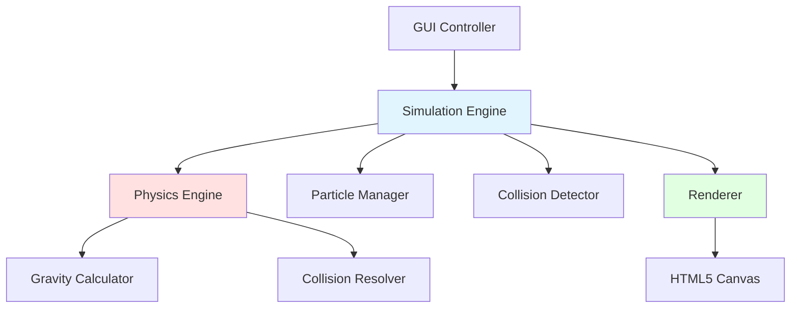

# Design-Dokument: Staubkorn-Aggregationssimulation

## Übersicht

Die Staubkorn-Aggregationssimulation ist eine browserbasierte 2D-Physiksimulation, die die Aggregation von Staubkörnern unter Gravitationseinfluss darstellt. Die Architektur folgt einer klaren Trennung zwischen Physik-Engine, Rendering-System und Benutzeroberfläche, um maximale Performance und zukünftige Erweiterbarkeit auf 3D zu gewährleisten.

### Kernprinzipien

1. **Performance-First**: Optimierte Datenstrukturen und Algorithmen für Echtzeit-Simulation mit vielen Teilchen
2. **Dimensionsunabhängigkeit**: Vektorbasierte Berechnungen, die auf 3D erweiterbar sind
3. **Modulare Architektur**: Klare Trennung zwischen Physik, Rendering und UI
4. **Erweiterbarkeit**: Plugin-System für alternative Gravitationsformeln

## Architektur

Die Simulation folgt einer geschichteten Architektur mit klaren Verantwortlichkeiten:



### Schichten

1. **Presentation Layer** (GUI Controller)
   - Benutzerinteraktion
   - Parameter-Konfiguration
   - Simulationssteuerung (Play/Pause/Reset)

2. **Simulation Layer** (Simulation Engine)
   - Hauptschleife (Game Loop)
   - Zeitschritt-Management
   - Koordination zwischen Physik und Rendering

3. **Physics Layer** (Physics Engine)
   - Newton'sche Mechanik
   - Gravitationsberechnungen
   - Kollisionserkennung und -auflösung
   - Impuls- und Drehimpulserhaltung

4. **Rendering Layer** (Renderer)
   - Canvas-basierte Darstellung
   - Visuelle Effekte (Rotation, Farbkodierung)
   - Kamera-Transformation (Zoom, Pan)

## Komponenten und Schnittstellen

### 1. Vektor-Klasse

Dimensionsunabhängige Vektoroperationen für 2D (erweiterbar auf 3D):

```typescript
class Vector2D {
  x: number;
  y: number;
  
  // Konstruktor
  constructor(x: number, y: number)
  
  // Vektoroperationen
  add(other: Vector2D): Vector2D
  subtract(other: Vector2D): Vector2D
  multiply(scalar: number): Vector2D
  divide(scalar: number): Vector2D
  
  // Berechnungen
  magnitude(): number
  normalize(): Vector2D
  dot(other: Vector2D): number
  distanceTo(other: Vector2D): number
  
  // Statische Methoden
  static zero(): Vector2D
  static random(min: number, max: number): Vector2D
}
```

### 2. Particle-Klasse

Repräsentiert ein einzelnes Staubkorn:

```typescript
class Particle {
  id: string;
  position: Vector2D;
  velocity: Vector2D;
  mass: number;
  radius: number;  // Berechnet aus Masse
  
  constructor(position: Vector2D, velocity: Vector2D, mass: number)
  
  // Physik-Updates
  applyForce(force: Vector2D, deltaTime: number): void
  update(deltaTime: number): void
  
  // Hilfsmethoden
  kineticEnergy(): number
  momentum(): Vector2D
}
```

### 3. Conglomerate-Klasse

Repräsentiert ein Konglomerat aus mehreren Teilchen:

```typescript
class Conglomerate {
  id: string;
  particles: Particle[];
  centerOfMass: Vector2D;
  velocity: Vector2D;
  totalMass: number;
  angularVelocity: number;  // Drehgeschwindigkeit
  
  constructor(particles: Particle[])
  
  // Physik-Updates
  applyForce(force: Vector2D, deltaTime: number): void
  applyTorque(torque: number, deltaTime: number): void
  update(deltaTime: number): void
  
  // Berechnungen
  calculateCenterOfMass(): Vector2D
  calculateMomentOfInertia(): number
  calculateAngularMomentum(): number
  
  // Konglomerat-Management
  merge(other: Conglomerate): Conglomerate
  contains(particle: Particle): boolean
}
```

### 4. Particle Manager

Verwaltet alle Teilchen und Konglomerate:

```typescript
interface ParticleSpawnConfig {
  spawnRate: number;           // Teilchen pro Sekunde
  massRange: [number, number]; // Min/Max Masse
  energyRange: [number, number]; // Min/Max kinetische Energie
}

class ParticleManager {
  particles: Particle[];
  conglomerates: Conglomerate[];
  config: ParticleSpawnConfig;
  bounds: Rectangle;  // Simulationsebene
  
  constructor(bounds: Rectangle, config: ParticleSpawnConfig)
  
  // Teilchen-Management
  spawnParticle(): Particle
  removeParticle(particle: Particle): void
  wrapParticle(particle: Particle): void  // Wrap-around
  
  // Konglomerat-Management
  createConglomerate(p1: Particle, p2: Particle): Conglomerate
  mergeConglomerates(c1: Conglomerate, c2: Conglomerate): Conglomerate
  
  // Update
  update(deltaTime: number): void
  
  // Abfragen
  getAllEntities(): (Particle | Conglomerate)[]
  getEntityCount(): number
}
```

### 5. Collision Detector

Effiziente Kollisionserkennung mit Spatial Hashing:

```typescript
class SpatialHash {
  cellSize: number;
  grid: Map<string, (Particle | Conglomerate)[]>;
  
  constructor(cellSize: number)
  
  clear(): void
  insert(entity: Particle | Conglomerate): void
  getNearby(entity: Particle | Conglomerate): (Particle | Conglomerate)[]
  
  private hash(position: Vector2D): string
}

class CollisionDetector {
  spatialHash: SpatialHash;
  
  constructor(cellSize: number)
  
  // Kollisionserkennung
  detectCollisions(entities: (Particle | Conglomerate)[]): CollisionPair[]
  checkCollision(e1: Particle | Conglomerate, e2: Particle | Conglomerate): boolean
  
  // Hilfsmethoden
  private getRadius(entity: Particle | Conglomerate): number
  private getPosition(entity: Particle | Conglomerate): Vector2D
}

interface CollisionPair {
  entity1: Particle | Conglomerate;
  entity2: Particle | Conglomerate;
}
```

### 6. Physics Engine

Implementiert Newton'sche Mechanik:

```typescript
interface GravityFormula {
  calculate(m1: number, m2: number, distance: number): number;
}

class NewtonianGravity implements GravityFormula {
  G: number;  // Gravitationskonstante
  
  constructor(G: number)
  
  calculate(m1: number, m2: number, distance: number): number {
    // F = G * m1 * m2 / r²
    return this.G * m1 * m2 / (distance * distance);
  }
}

class PhysicsEngine {
  gravityFormula: GravityFormula;
  elasticity: number;  // Kollisionselastizität (0-1)
  
  constructor(gravityFormula: GravityFormula, elasticity: number)
  
  // Kraftberechnungen
  calculateGravitationalForce(e1: Particle | Conglomerate, e2: Particle | Conglomerate): Vector2D
  applyGravity(entities: (Particle | Conglomerate)[], deltaTime: number): void
  
  // Kollisionsauflösung
  resolveCollision(pair: CollisionPair): void
  calculateCollisionImpulse(e1: Particle | Conglomerate, e2: Particle | Conglomerate): Vector2D
  
  // Hilfsmethoden
  private getMass(entity: Particle | Conglomerate): number
  private getVelocity(entity: Particle | Conglomerate): Vector2D
  private setVelocity(entity: Particle | Conglomerate, velocity: Vector2D): void
}
```

### 7. Simulation Engine

Hauptschleife und Koordination:

```typescript
interface SimulationConfig {
  targetFPS: number;
  timeScale: number;  // Simulationsgeschwindigkeit
  accuracySteps: number;  // Unterteilungen pro Frame
}

class SimulationEngine {
  particleManager: ParticleManager;
  collisionDetector: CollisionDetector;
  physicsEngine: PhysicsEngine;
  renderer: Renderer;
  config: SimulationConfig;
  
  isRunning: boolean;
  lastFrameTime: number;
  
  constructor(
    particleManager: ParticleManager,
    collisionDetector: CollisionDetector,
    physicsEngine: PhysicsEngine,
    renderer: Renderer,
    config: SimulationConfig
  )
  
  // Simulationssteuerung
  start(): void
  pause(): void
  reset(): void
  
  // Hauptschleife
  private gameLoop(currentTime: number): void
  private update(deltaTime: number): void
  private render(): void
  
  // Konfiguration
  setTimeScale(scale: number): void
  setAccuracySteps(steps: number): void
}
```

### 8. Renderer

Canvas-basierte Darstellung:

```typescript
interface RenderConfig {
  colorMode: 'mass' | 'velocity' | 'energy';
  showVelocityVectors: boolean;
  showRotation: boolean;
}

class Camera {
  position: Vector2D;
  zoom: number;
  
  constructor()
  
  // Kamera-Steuerung
  pan(delta: Vector2D): void
  zoomIn(factor: number): void
  zoomOut(factor: number): void
  reset(): void
  
  // Transformation
  worldToScreen(worldPos: Vector2D): Vector2D
  screenToWorld(screenPos: Vector2D): Vector2D
}

class Renderer {
  canvas: HTMLCanvasElement;
  context: CanvasRenderingContext2D;
  camera: Camera;
  config: RenderConfig;
  
  constructor(canvas: HTMLCanvasElement, config: RenderConfig)
  
  // Rendering
  clear(): void
  render(entities: (Particle | Conglomerate)[]): void
  
  // Entitäten zeichnen
  private renderParticle(particle: Particle): void
  private renderConglomerate(conglomerate: Conglomerate): void
  
  // Visuelle Effekte
  private getColor(entity: Particle | Conglomerate): string
  private drawRotationIndicator(conglomerate: Conglomerate): void
  private drawVelocityVector(entity: Particle | Conglomerate): void
  
  // Konfiguration
  setColorMode(mode: 'mass' | 'velocity' | 'energy'): void
}
```

### 9. GUI Controller

Benutzeroberfläche und Steuerung:

```typescript
class GUIController {
  simulationEngine: SimulationEngine;
  particleManager: ParticleManager;
  physicsEngine: PhysicsEngine;
  renderer: Renderer;
  
  // UI-Elemente
  playButton: HTMLButtonElement;
  pauseButton: HTMLButtonElement;
  resetButton: HTMLButtonElement;
  
  spawnRateSlider: HTMLInputElement;
  massRangeSlider: [HTMLInputElement, HTMLInputElement];
  energyRangeSlider: [HTMLInputElement, HTMLInputElement];
  elasticitySlider: HTMLInputElement;
  accuracySlider: HTMLInputElement;
  timeScaleSlider: HTMLInputElement;
  colorModeSelect: HTMLSelectElement;
  
  constructor(
    simulationEngine: SimulationEngine,
    particleManager: ParticleManager,
    physicsEngine: PhysicsEngine,
    renderer: Renderer
  )
  
  // Initialisierung
  initialize(): void
  private bindEventListeners(): void
  
  // Event-Handler
  private onPlayClick(): void
  private onPauseClick(): void
  private onResetClick(): void
  private onSpawnRateChange(value: number): void
  private onMassRangeChange(min: number, max: number): void
  private onEnergyRangeChange(min: number, max: number): void
  private onElasticityChange(value: number): void
  private onAccuracyChange(value: number): void
  private onTimeScaleChange(value: number): void
  private onColorModeChange(mode: string): void
  
  // Kamera-Steuerung
  private onMouseWheel(event: WheelEvent): void
  private onMouseDrag(event: MouseEvent): void
}
```

## Datenmodelle

### Simulationszustand

```typescript
interface SimulationState {
  particles: Particle[];
  conglomerates: Conglomerate[];
  time: number;
  frameCount: number;
  isRunning: boolean;
}
```

### Konfiguration

```typescript
interface Configuration {
  simulation: SimulationConfig;
  particles: ParticleSpawnConfig;
  physics: {
    gravitationalConstant: number;
    elasticity: number;
  };
  rendering: RenderConfig;
  bounds: Rectangle;
}

interface Rectangle {
  x: number;
  y: number;
  width: number;
  height: number;
}
```

## Correctness Properties

*Eine Property ist eine Eigenschaft oder ein Verhalten, das über alle gültigen Ausführungen eines Systems wahr sein sollte - im Wesentlichen eine formale Aussage darüber, was das System tun soll. Properties dienen als Brücke zwischen menschenlesbaren Spezifikationen und maschinenverifizierbaren Korrektheitsgarantien.*


### Property 1: Teilcheneintritt-Validierung

*Für alle* neu eintretenden Teilchen müssen folgende Bedingungen erfüllt sein:
- Die Position liegt am Rand der Simulationsebene
- Die Masse liegt innerhalb des konfigurierten Massenbereichs
- Die kinetische Energie liegt innerhalb des konfigurierten Energiebereichs
- Der Eintrittswinkel ist zufällig verteilt

**Validiert: Anforderungen 3.2, 3.3, 3.4, 3.5**

### Property 2: Wrap-around Konsistenz

*Für alle* Teilchen, die die Simulationsebene verlassen, muss gelten: Wenn ein Teilchen über eine Kante hinausgeht, erscheint es auf der gegenüberliegenden Seite mit identischen Parametern (Masse, Geschwindigkeit, Energie).

**Validiert: Anforderung 3.6**

### Property 3: Massenproportionalität und -erhaltung

*Für alle* Teilchen und Konglomerate gilt:
- Der Radius ist proportional zur Masse
- Bei Verschmelzung zweier Entitäten ist die Gesamtmasse des resultierenden Konglomerats gleich der Summe der Einzelmassen (Massenerhaltung)

**Validiert: Anforderungen 5.1, 5.2, 7.3**

### Property 4: Newton'sche Gravitationsformel

*Für alle* Paare von Teilchen/Konglomeraten mit Massen m1 und m2 im Abstand r gilt: Die Gravitationskraft F muss der Formel F = G × m1 × m2 / r² entsprechen, wobei G die Gravitationskonstante ist.

**Validiert: Anforderung 6.1**

### Property 5: Newton'sches Bewegungsgesetz

*Für alle* Teilchen/Konglomerate, auf die eine Kraft F wirkt, muss die resultierende Beschleunigung a der Formel a = F / m entsprechen, wobei m die Masse ist.

**Validiert: Anforderung 6.2**

### Property 6: Impulserhaltung bei Kollisionen

*Für alle* Kollisionen zwischen Teilchen/Konglomeraten gilt: Der Gesamtimpuls vor der Kollision muss gleich dem Gesamtimpuls nach der Kollision sein (p_vorher = p_nachher).

**Validiert: Anforderungen 6.3, 7.4**

### Property 7: Energieerhaltung mit Elastizität

*Für alle* Kollisionen mit Elastizitätskoeffizient e gilt: Die kinetische Energie nach der Kollision muss E_nachher = e × E_vorher entsprechen (wobei e ∈ [0, 1]).

**Validiert: Anforderung 6.4**

### Property 8: Konglomerat-Bildung bei Kontakt

*Für alle* Paare von Teilchen/Konglomeraten, deren Abstand kleiner oder gleich der Summe ihrer Radien ist, muss das System ein neues Konglomerat erstellen, das beide Entitäten enthält.

**Validiert: Anforderung 7.1**

### Property 9: Teilchen-Beibehaltung in Konglomeraten

*Für alle* Konglomerate gilt: Alle ursprünglichen Teilchen, die zur Bildung des Konglomerats beigetragen haben, müssen als separate Elemente im Konglomerat gespeichert sein.

**Validiert: Anforderung 7.2**

### Property 10: Drehimpulserhaltung

*Für alle* Konglomerate und Kollisionen mit Drehimpuls gilt: Der Gesamtdrehimpuls des Systems muss vor und nach der Kollision erhalten bleiben (L_vorher = L_nachher).

**Validiert: Anforderungen 7.5, 9.2**

### Property 11: Konfigurationsänderungen wirken sofort

*Für alle* Konfigurationsänderungen (Eintrittsrate, Massenbereich, Energiebereich, Elastizität, Genauigkeitsschritte, Zeitskala) gilt: Nach der Änderung müssen alle neu eintretenden Teilchen oder nachfolgenden Berechnungen die neuen Werte verwenden.

**Validiert: Anforderungen 2.5, 4.6, 10.7**

## Fehlerbehandlung

### Numerische Stabilität

**Division durch Null bei Gravitationsberechnung:**
- Problem: Wenn zwei Teilchen sehr nahe beieinander sind (r → 0), wird die Gravitationskraft unendlich
- Lösung: Einführung eines Mindestabstands (epsilon) für die Gravitationsberechnung
- Implementierung: `distance = max(actualDistance, EPSILON)`

**Floating-Point-Ungenauigkeiten:**
- Problem: Akkumulation von Rundungsfehlern bei vielen Zeitschritten
- Lösung: Verwendung von Double-Precision (64-bit) für alle Berechnungen
- Periodische Normalisierung von Vektoren

### Kollisionserkennung

**Überlappende Teilchen:**
- Problem: Bei hohen Geschwindigkeiten können Teilchen sich überlappen, ohne dass eine Kollision erkannt wird (Tunneling)
- Lösung: Continuous Collision Detection (CCD) oder kleinere Zeitschritte bei hohen Geschwindigkeiten
- Implementierung: Adaptive Zeitschrittgröße basierend auf maximaler Geschwindigkeit

**Mehrfachkollisionen:**
- Problem: Ein Teilchen kollidiert gleichzeitig mit mehreren anderen
- Lösung: Sequentielle Auflösung aller Kollisionen in einem Frame
- Priorisierung nach Eindringtiefe

### Performance-Degradation

**Zu viele Teilchen:**
- Problem: Performance sinkt unter 30 FPS
- Lösung: Warnung an Benutzer, automatische Reduzierung der Eintrittsrate
- Implementierung: FPS-Monitoring und dynamische Anpassung

**Spatial Hash Overflow:**
- Problem: Zu viele Teilchen in einer Zelle
- Lösung: Dynamische Anpassung der Zellgröße
- Implementierung: Neuberechnung der optimalen Zellgröße bei Bedarf

### Benutzer-Eingaben

**Ungültige Konfigurationswerte:**
- Problem: Benutzer gibt ungültige Werte ein (z.B. negative Masse)
- Lösung: Input-Validierung mit Fehlermeldungen
- Implementierung: Min/Max-Constraints auf allen Slidern

**Extremwerte:**
- Problem: Sehr große oder sehr kleine Werte führen zu numerischen Problemen
- Lösung: Sinnvolle Grenzen für alle Parameter
- Beispiel: Masse ∈ [0.1, 1000], Energie ∈ [1, 10000]

## Teststrategie

Die Teststrategie kombiniert Unit-Tests für spezifische Beispiele und Edge Cases mit Property-Based Tests für universelle Eigenschaften.

### Unit-Tests

Unit-Tests fokussieren sich auf:

1. **Spezifische Beispiele:**
   - Kollision zweier Teilchen mit bekannten Parametern
   - Gravitationsberechnung mit bekannten Massen und Abständen
   - Wrap-around an jeder Kante der Simulationsebene

2. **Edge Cases:**
   - Teilchen mit minimaler/maximaler Masse
   - Kollision bei sehr hohen Geschwindigkeiten
   - Konglomerat aus vielen Teilchen (>100)
   - Zoom auf Minimum/Maximum

3. **Fehlerbehandlung:**
   - Division durch Null bei Gravitationsberechnung
   - Ungültige Konfigurationswerte
   - Leere Simulationsebene

4. **Integrationspunkte:**
   - GUI-Controller → Simulation Engine
   - Physics Engine → Collision Detector
   - Renderer → Canvas

### Property-Based Tests

Property-Based Tests validieren universelle Eigenschaften über viele generierte Eingaben:

1. **Konfiguration:**
   - Framework: fast-check (für TypeScript/JavaScript)
   - Mindestens 100 Iterationen pro Property-Test
   - Jeder Test referenziert seine Design-Property

2. **Test-Tags:**
   - Format: `// Feature: dust-particle-aggregation, Property N: [Property-Text]`
   - Beispiel: `// Feature: dust-particle-aggregation, Property 6: Impulserhaltung bei Kollisionen`

3. **Generatoren:**
   - Zufällige Teilchen mit variierenden Massen, Positionen, Geschwindigkeiten
   - Zufällige Konglomerate mit 2-50 Teilchen
   - Zufällige Konfigurationen innerhalb gültiger Bereiche

4. **Property-Implementierung:**
   - Jede Correctness Property wird durch EINEN Property-Based Test implementiert
   - Tests verwenden Generatoren für umfassende Eingabeabdeckung
   - Assertions prüfen die universelle Eigenschaft

### Test-Organisation

```
tests/
├── unit/
│   ├── vector.test.ts
│   ├── particle.test.ts
│   ├── conglomerate.test.ts
│   ├── collision-detector.test.ts
│   ├── physics-engine.test.ts
│   ├── particle-manager.test.ts
│   ├── renderer.test.ts
│   └── gui-controller.test.ts
├── properties/
│   ├── particle-spawn.property.test.ts      // Property 1
│   ├── wraparound.property.test.ts          // Property 2
│   ├── mass-conservation.property.test.ts   // Property 3
│   ├── gravity.property.test.ts             // Property 4
│   ├── motion.property.test.ts              // Property 5
│   ├── momentum.property.test.ts            // Property 6
│   ├── energy.property.test.ts              // Property 7
│   ├── collision.property.test.ts           // Property 8
│   ├── conglomerate.property.test.ts        // Property 9
│   ├── angular-momentum.property.test.ts    // Property 10
│   └── configuration.property.test.ts       // Property 11
└── integration/
    ├── simulation-loop.test.ts
    └── end-to-end.test.ts
```

### Testabdeckung

**Ziele:**
- Unit-Tests: >80% Code-Coverage
- Property-Tests: Alle 11 Correctness Properties abgedeckt
- Integration-Tests: Alle Hauptszenarien abgedeckt

**Kontinuierliche Integration:**
- Alle Tests laufen bei jedem Commit
- Property-Tests mit 100 Iterationen in CI
- Performance-Tests auf dedizierter Hardware

### Manuelle Tests

Zusätzlich zu automatisierten Tests:

1. **Browser-Kompatibilität:**
   - Manuelle Tests in Chrome, Firefox, Safari, Edge
   - Visuelle Inspektion der Darstellung

2. **Performance-Profiling:**
   - Chrome DevTools Performance-Analyse
   - Identifikation von Bottlenecks

3. **Benutzerfreundlichkeit:**
   - GUI-Responsiveness
   - Intuitivität der Steuerung

## Implementierungshinweise

### Performance-Optimierungen

1. **Spatial Hashing:**
   - Zellgröße = 2 × maximaler Teilchenradius
   - Nur benachbarte Zellen für Kollisionsprüfung
   - Neuberechnung nur bei Bedarf

2. **Object Pooling:**
   - Wiederverwendung von Particle-Objekten
   - Vermeidung von Garbage Collection
   - Pre-Allokation von Arrays

3. **Canvas-Optimierung:**
   - Dirty Rectangle Rendering (nur geänderte Bereiche)
   - Off-Screen Canvas für komplexe Formen
   - RequestAnimationFrame für flüssige Animation

4. **Web Workers:**
   - Physikberechnungen in separatem Thread
   - Vermeidung von UI-Blockierung
   - Message Passing für Zustandsübertragung

### Erweiterbarkeit auf 3D

1. **Vektor-Abstraktion:**
   - Interface `IVector` mit `add()`, `subtract()`, etc.
   - Implementierungen: `Vector2D`, `Vector3D`
   - Alle Physikberechnungen verwenden Interface

2. **Renderer-Abstraktion:**
   - Interface `IRenderer` mit `render()`, `clear()`
   - Implementierungen: `Canvas2DRenderer`, `WebGLRenderer`
   - Austauschbar ohne Änderung der Physik

3. **Dimensionsparameter:**
   - Konfiguration: `dimensions: 2 | 3`
   - Factory-Pattern für Vektor-Erstellung
   - Bedingte Renderer-Auswahl

### Gravitationsformeln

**Plugin-System:**

```typescript
interface GravityFormula {
  name: string;
  calculate(m1: number, m2: number, distance: number): number;
}

class GravityRegistry {
  private formulas: Map<string, GravityFormula>;
  
  register(formula: GravityFormula): void
  get(name: string): GravityFormula
  list(): string[]
}
```

**Beispiel-Implementierungen:**

1. **Newton'sche Gravitation:** F = G × m1 × m2 / r²
2. **Modifizierte Gravitation:** F = G × m1 × m2 / (r² + ε) (numerisch stabiler)
3. **Lennard-Jones-Potential:** Für molekulare Simulationen
4. **Konstante Kraft:** Für vereinfachte Tests

### Zeitschritt-Management

**Adaptive Zeitschritte:**

```typescript
function calculateDeltaTime(maxVelocity: number, accuracySteps: number): number {
  const baseTimeStep = 1 / 60; // 60 FPS
  const subSteps = Math.max(1, Math.ceil(maxVelocity / SAFE_VELOCITY));
  return baseTimeStep / (subSteps * accuracySteps);
}
```

**Vorteile:**
- Verhindert Tunneling bei hohen Geschwindigkeiten
- Benutzer kann Genauigkeit vs. Performance abwägen
- Automatische Anpassung an Simulationszustand

